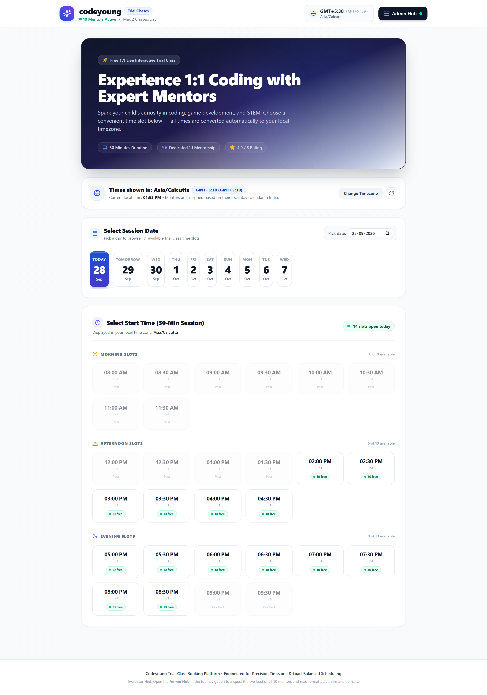
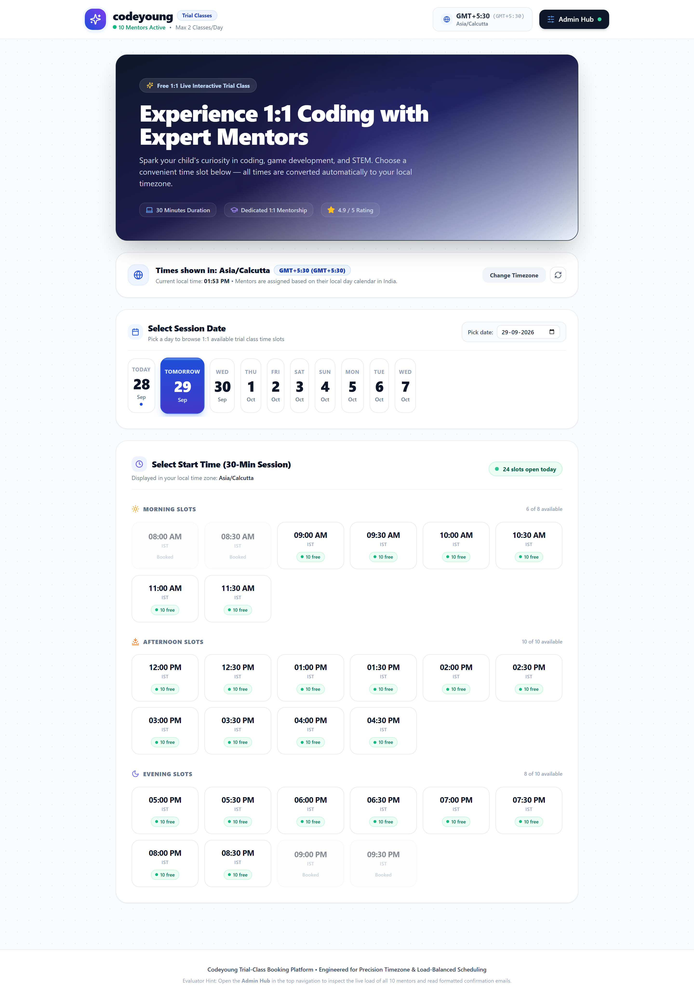
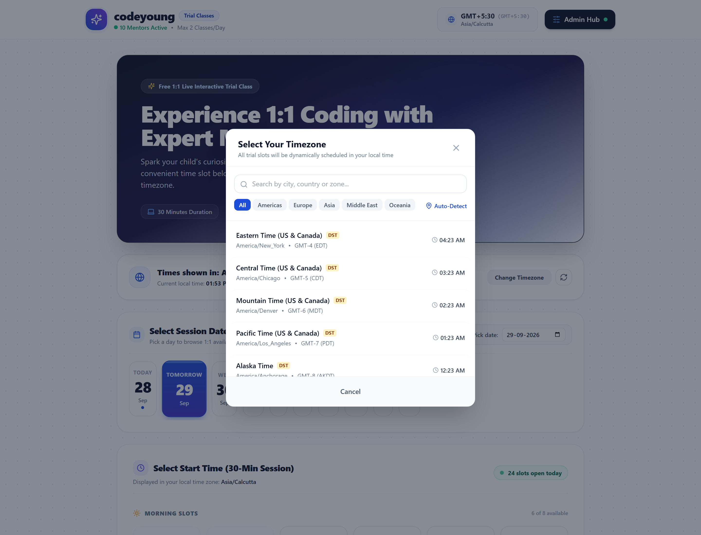
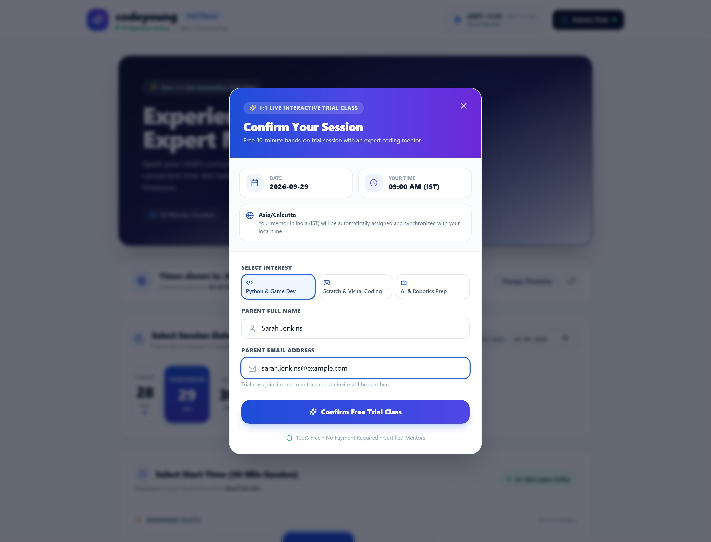
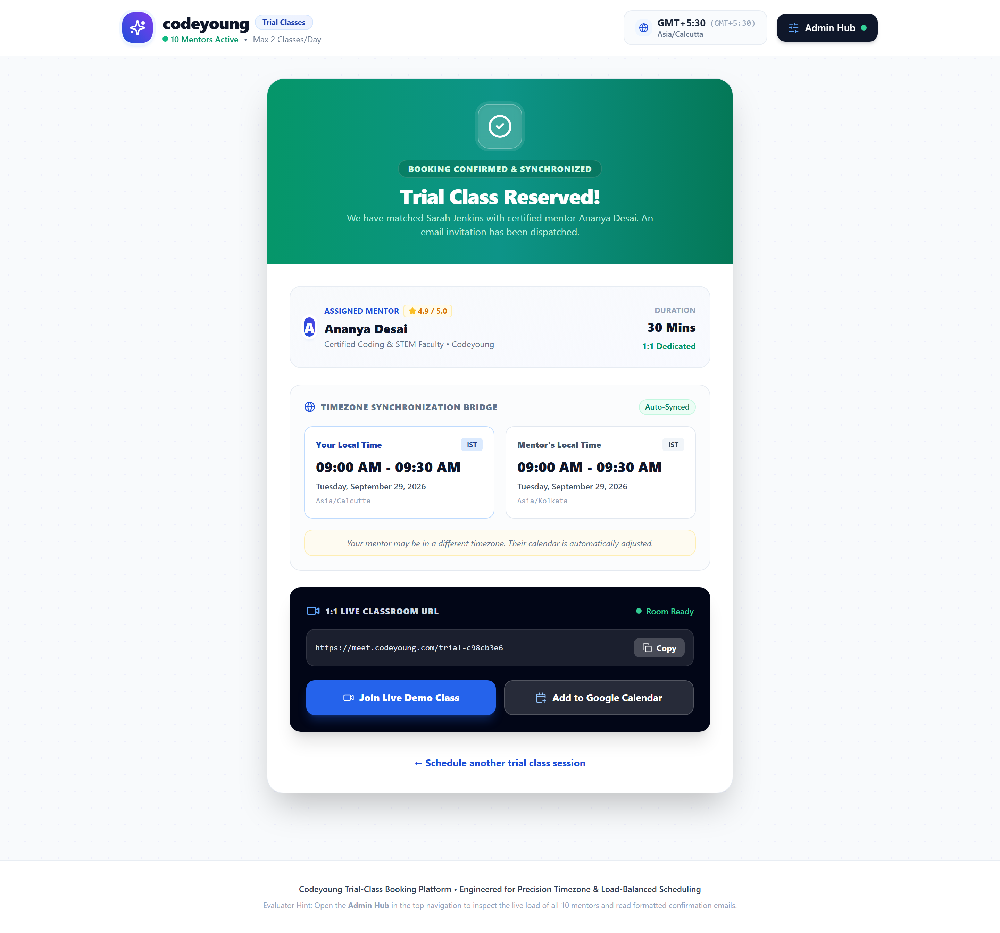
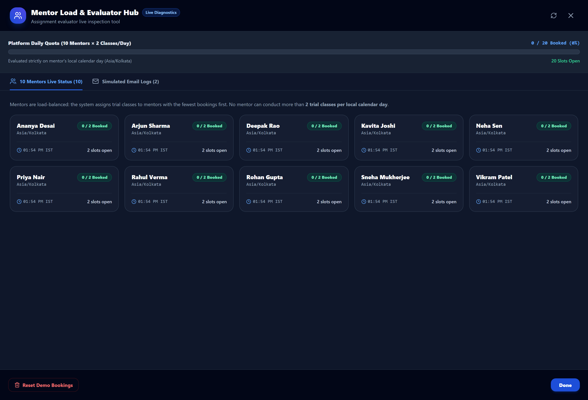
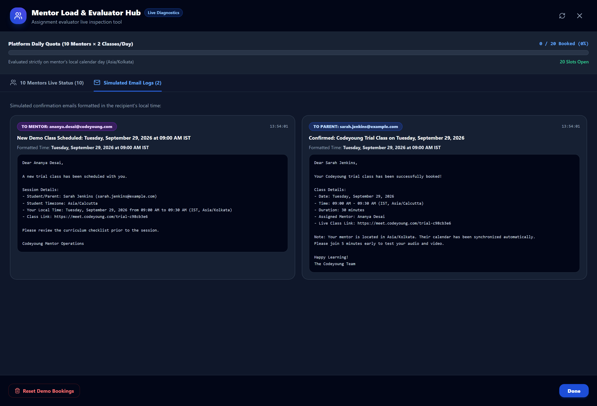
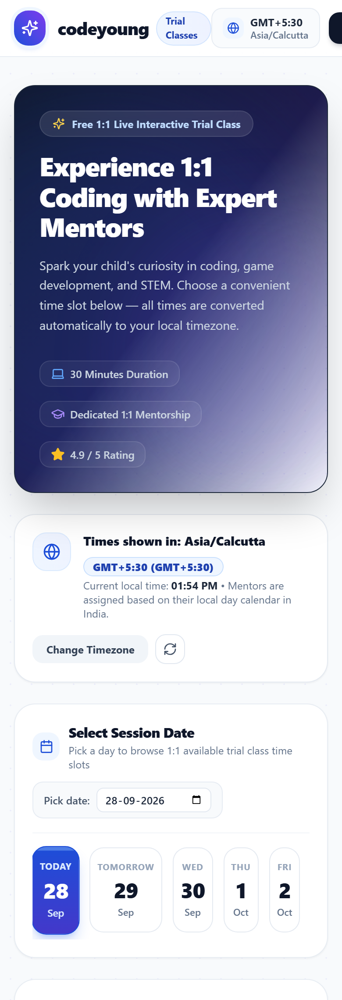
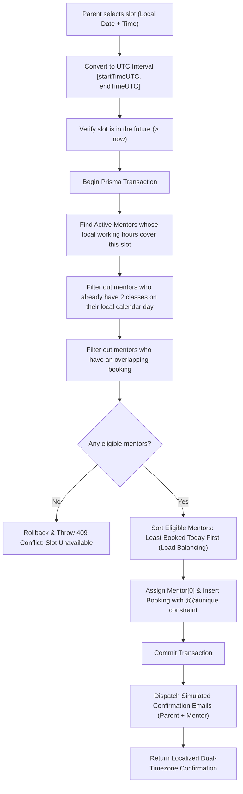

# Codeyoung Trial-Class Appointment Booking System

A production-oriented, timezone-aware 1:1 trial-class booking platform built for the Codeyoung Full Stack Engineer assignment. Built with a **React (Vite) + Tailwind CSS** frontend, a modular **Node.js (Express)** backend, and **SQLite with Prisma ORM**.

---

## 📌 Executive Summary

Codeyoung connects students and parents worldwide with expert coding mentors. Because parents (e.g., in US Eastern, US Pacific, UK) and mentors (in India IST) operate across different time zones and Daylight Saving Time (DST) rules, scheduling requires strict timezone precision and concurrency protection.

This system guarantees:
1. **Accurate Timezone & DST Handling**: True IANA timezone conversions with zero manual offset arithmetic.
2. **Mentor Allocation & Quota Enforcement**: Exactly 10 mentors available, each capped at a maximum of **2 trial classes per local calendar day** (evaluated in the mentor's local timezone).
3. **Double-Booking & Race Condition Prevention**: Database-level unique constraints and atomic transactions protect against concurrent bookings.
4. **Intuitive Parent Experience**: Seamless local timezone detection, dual timezone confirmation, live meeting link generation, and a diagnostic Admin & Demo Hub.

---

## 🛠️ Tech Stack

| Domain | Technology | Justification |
| :--- | :--- | :--- |
| **Frontend** | React 18, Vite | High-performance reactive UI with instant hot-reloading |
| **Styling** | Tailwind CSS, Lucide Icons | Responsive, accessible, and clean design system |
| **Backend** | Node.js (ESM), Express.js | Lightweight, non-blocking asynchronous REST API |
| **Database** | SQLite + Prisma ORM | Zero-configuration local database with strict typing & migrations |
| **Timezone / DST**| Luxon + Intl API | Standard IANA timezone database (`America/New_York`, `Asia/Kolkata`, etc.) |
| **Validation** | Zod | Robust schema validation for runtime request query & body |
| **Testing** | Vitest + Supertest | Blazing fast integration and unit testing suite |

---

## ⚡ Quick Start (60 Seconds)

> [!NOTE]
> **Security & Professional Git Practice (For Reviewers):**
> Following industry standards, actual `.env` files are ignored by `.gitignore` and never committed to version control. A documented `.env.example` template is included in the repository.

```bash
# 1. Clone this repository
git clone https://github.com/keerthanvedha-sys/codeyoung-trial-class-booking.git
cd codeyoung-trial-class-booking

# 2. Install all dependencies (root, backend, frontend)
npm run install:all

# 3. Create .env using .env.example as a template
copy .env.example server\.env   # Windows PowerShell
# cp .env.example server/.env   # macOS / Linux

# 4. Push database schema & seed 10 mentors
npm run seed                    # Runs prisma db push + mentor seeding

# 5. Start full-stack development servers
npm run dev
```

* **Frontend**: `http://localhost:5173`
* **Backend API**: `http://localhost:5000/api`
* **Health Check**: `http://localhost:5000/api/health`

---

## 📸 Application Screenshots & Workflow Walkthrough

Walkthrough screenshots are stored in [`docs/screenshots/`](docs/screenshots/):

### 1. Booking Page & Hero Experience
*Modern EdTech interface with ambient lighting, interactive calendar date selector, live timezone badge, and active mentor indicator.*



---

### 2. Available Time Slots Grid
*Dynamic 30-minute slot grid categorized into Morning, Afternoon, and Evening with live availability counters (e.g. `10 free`) evaluated in parent's local timezone.*



---

### 3. Dynamic Timezone Support Modal
*Searchable IANA timezone picker supporting US (Eastern, Central, Mountain, Pacific), UK (BST/GMT), India (IST), and global regions with automatic DST offset detection.*



---

### 4. Interactive Booking Modal & Curriculum Selection
*Clean parent checkout form with child curriculum track selectors (Python & Game Dev, Scratch, AI & Robotics Prep) and validation.*



---

### 5. Dual-Timezone Booking Confirmation & Live Meeting Link
*Ticket-style confirmation featuring a dual-timezone synchronizer bridge (Parent local time vs. Mentor IST time), mentor spotlight bio, 1-click meeting link, and Google Calendar sync button.*



---

### 6. Evaluator Admin & Demo Hub (Real-Time Mentor Quotas)
*Comprehensive diagnostic drawer enabling reviewers to inspect all 10 mentors, live daily booking gauges ($X/2$), platform capacity progress bar ($X/20$), and mentor working hours in IST.*



---

### 7. Simulated Transactional Email Inspector
*Audit view of simulated notification emails dispatched to parent and mentor upon confirmation, formatted with localized date/time displays.*



---

### 8. Responsive Mobile Experience (iPhone 14 / Mobile Viewport)
*Fully responsive mobile design tested at 390x844 resolution, providing a smooth touch-friendly booking workflow on mobile devices.*



---

## 🏗️ Architecture & Clean Separation of Concerns

The backend enforces a strict layered architecture:

```
HTTP Request
     │
     ▼
[Routes Layer]        --> Validates path and delegates to controller
     │
     ▼
[Validation Layer]    --> Zod schemas validate types, formats, IANA zones, & regex
     │
     ▼
[Controllers Layer]   --> Extracts validated params, handles HTTP status codes
     │
     ▼
[Services Layer]      --> 100% of business logic lives here:
                          - bookingService.js   (atomic booking & race control)
                          - mentorService.js    (mentor eligibility & stats)
                          - timezoneService.js  (UTC conversions & day ranges)
                          - notificationService.js (dummy email dispatch)
     │
     ▼
[Database Layer]      --> Prisma Client + SQLite database
```

### Core Services
- **`timezoneService.js`**: Pure timezone transformation utilities using Luxon. Calculates exact UTC boundaries for any mentor's local day.
- **`mentorService.js`**: Queries active mentors, checks working hours, verifies local day quotas, and inspects overlapping bookings.
- **`bookingService.js`**: Executes the transactional mentor assignment algorithm with load balancing, creates parent records, generates dummy video links, and fires simulated notifications.
- **`notificationService.js`**: Extensible notification abstraction. In development, `DummyNotificationService` logs formatted emails to the console and persists them to `NotificationLog` for interview review.

---

## 🌍 Timezone & Daylight Saving Time (DST) Strategy

### 1. The Golden Rule: Store in UTC, Display in Local Time
* Actual appointment start and end times are **always persisted as UTC timestamps** (`startTimeUTC`, `endTimeUTC`).
* Local time is never stored as the source of truth in the database.
* Conversions between parent-local time, UTC, and mentor-local time occur dynamically using IANA timezone identifiers (e.g., `America/New_York`, `Europe/London`, `Asia/Kolkata`).

### 2. Daylight Saving Time (DST)
Offsets are never hardcoded. Luxon evaluates the exact UTC offset based on the appointment date:
* `America/New_York` automatically resolves to **EDT (UTC-4)** in Summer and **EST (UTC-5)** in Winter.
* `Europe/London` automatically resolves to **BST (UTC+1)** in Summer and **GMT (UTC+0)** in Winter.
* `Asia/Kolkata` consistently resolves to **IST (UTC+5:30)** without DST.

### 3. Mentor Local Calendar Day Evaluation
The 2-class daily limit must be enforced on the **mentor's local calendar day**, not the parent's date and not UTC date.

> **Example**:
> A parent in New York (`America/New_York`, EDT UTC-4) books a slot on **Tuesday, October 27 at 11:30 PM**.
> - In UTC, this is **Wednesday, October 28 at 03:30 AM**.
> - In India (`Asia/Kolkata`, IST UTC+5:30), this is **Wednesday, October 28 at 09:00 AM**.
>
> The system converts the appointment timestamp to the mentor's timezone, computes the start (`2026-10-28 00:00:00 IST`) and end (`2026-10-28 23:59:59 IST`) of that local day, converts those boundaries to UTC (`2026-10-27 18:30:00Z` to `2026-10-28 18:29:59Z`), and counts the mentor's bookings within that window.

---

## ⚖️ Mentor Assignment Algorithm

When a parent selects an available slot:



### Why "Least-Booked First" Load Balancing?
1. **Fairness**: Distributes trial classes evenly across all 10 mentors.
2. **Availability Preservation**: Prevents one mentor from burning their 2-class quota early in the day while other mentors remain idle, maximizing available slots for parents later in the day.
3. **Simplicity & Explainability**: Highly predictable and transparent to explain during code review.

---

## 🛡️ Race Condition & Double-Booking Protection

Concurrent requests targeting the last available mentor are safeguarded at multiple layers:
1. **Database-Level Constraint**:
   ```prisma
   model Booking {
     ...
     @@unique([mentorId, startTimeUTC])
   }
   ```
   If two requests attempt to book the same mentor at the identical start time, SQLite physically rejects the second write with a unique constraint error (`P2002`).
2. **Transaction Isolation**:
   Mentor filtering and booking creation are wrapped in `prisma.$transaction(async (tx) => { ... })`.
3. **User-Friendly Error Response**:
   Instead of a cryptic error, the backend catches concurrency conflicts and returns HTTP `409 Conflict`:
   ```json
   {
     "success": false,
     "error": "That slot was just booked by another parent. Please choose another available time.",
     "code": "SlotUnavailableError"
   }
   ```

---

## 🗄️ Database Schema

```prisma
datasource db {
  provider = "sqlite"
  url      = env("DATABASE_URL")
}

model Parent {
  id        String    @id @default(uuid())
  name      String
  email     String
  timezone  String
  createdAt DateTime  @default(now())
  bookings  Booking[]

  @@index([email])
}

model Mentor {
  id            String    @id @default(uuid())
  name          String
  email         String    @unique
  timezone      String    @default("Asia/Kolkata")
  active        Boolean   @default(true)
  workStartHour Int       @default(9)
  workEndHour   Int       @default(21)
  createdAt     DateTime  @default(now())
  bookings      Booking[]

  @@index([active])
}

model Booking {
  id           String   @id @default(uuid())
  parentId     String
  mentorId     String
  parent       Parent   @relation(fields: [parentId], references: [id], onDelete: Cascade)
  mentor       Mentor   @relation(fields: [mentorId], references: [id], onDelete: Cascade)
  startTimeUTC DateTime
  endTimeUTC   DateTime
  status       String   @default("CONFIRMED")
  meetingLink  String
  createdAt    DateTime @default(now())
  updatedAt    DateTime @updatedAt

  @@unique([mentorId, startTimeUTC])
  @@index([mentorId, startTimeUTC, endTimeUTC])
  @@index([startTimeUTC])
}

model NotificationLog {
  id                String   @id @default(uuid())
  bookingId         String
  recipientType     String   // "PARENT" | "MENTOR"
  recipientEmail    String
  recipientTimezone String
  subject           String
  body              String
  localTimeDisplay  String
  sentAt            DateTime @default(now())

  @@index([bookingId])
  @@index([sentAt])
}
```

---

## 📡 REST API Documentation

### 1. `GET /api/health`
Health check endpoint reporting API status and UTC server time.
* **Response (200 OK)**:
```json
{
  "status": "ok",
  "service": "codeyoung-booking-api",
  "timestampUTC": "2026-09-26T15:30:00.000Z"
}
```

### 2. `GET /api/slots`
Dynamically generates 30-minute slots for a given date in the parent's timezone and calculates mentor availability.
* **Query Parameters**:
  * `date` (string, required): `YYYY-MM-DD`
  * `timezone` (string, required): Valid IANA timezone (e.g. `America/New_York`)
* **Response (200 OK)**:
```json
{
  "success": true,
  "data": {
    "date": "2026-10-20",
    "parentTimezone": "America/New_York",
    "trialDurationMinutes": 30,
    "totalSlots": 28,
    "availableSlotsCount": 26,
    "isFullyBooked": false,
    "slots": [
      {
        "parentDate": "2026-10-20",
        "localTime": "10:00 AM",
        "localTime24": "10:00",
        "timeZoneAbbr": "EDT",
        "parentTimezone": "America/New_York",
        "startTimeUTC": "2026-10-20T14:00:00.000Z",
        "endTimeUTC": "2026-10-20T14:30:00.000Z",
        "available": true,
        "availableMentorsCount": 10,
        "reason": "AVAILABLE",
        "userMessage": "Available"
      }
    ]
  }
}
```

### 3. `POST /api/bookings`
Books an appointment, assigns an eligible mentor, and generates a live meeting link.
* **Request Body**:
```json
{
  "parentName": "Sarah Jenkins",
  "parentEmail": "sarah.jenkins@example.com",
  "parentTimezone": "America/New_York",
  "slotDate": "2026-10-20",
  "slotTime": "10:00"
}
```
* **Response (201 Created)**:
```json
{
  "success": true,
  "data": {
    "bookingId": "c983a99e-31bd-4fc7-bf98-8e68cfb99320",
    "meetingLink": "https://meet.codeyoung.com/trial-3a87f1b2",
    "durationMinutes": 30,
    "status": "CONFIRMED",
    "parent": {
      "name": "Sarah Jenkins",
      "email": "sarah.jenkins@example.com",
      "timezone": "America/New_York"
    },
    "mentor": {
      "name": "Arjun Sharma",
      "email": "arjun.sharma@codeyoung.com",
      "timezone": "Asia/Kolkata"
    },
    "times": {
      "utc": {
        "startTimeUTC": "2026-10-20T14:00:00.000Z",
        "endTimeUTC": "2026-10-20T14:30:00.000Z"
      },
      "parent": {
        "timezone": "America/New_York",
        "timeZoneAbbr": "EDT",
        "isInDST": true,
        "date": "Tuesday, October 20, 2026",
        "startTime": "10:00 AM",
        "endTime": "10:30 AM"
      },
      "mentor": {
        "timezone": "Asia/Kolkata",
        "timeZoneAbbr": "IST",
        "isInDST": false,
        "date": "Tuesday, October 20, 2026",
        "startTime": "07:30 PM",
        "endTime": "08:00 PM"
      }
    },
    "mentorNote": "Your mentor may be in a different timezone. Their calendar is automatically adjusted."
  }
}
```

### 4. `GET /api/mentors`
Returns all 10 mentors with active status, current local time, and today's booking counts for evaluation.

### 5. `GET /api/mentors/notifications`
Returns recent simulated email dispatches formatted for both parent and mentor.

### 6. `POST /api/bookings/reset`
Clears all bookings and notification logs to return the demo environment to a fresh state.

---

## 💻 Local Setup & Running Instructions

### Prerequisites
* **Node.js** >= 18.0.0 (Node 20+ or 24 recommended)
* **npm** >= 9.0.0

### Step 1: Clone Repository
```bash
git clone https://github.com/keerthanvedha-sys/codeyoung-trial-class-booking.git
cd codeyoung-trial-class-booking
```

### Step 2: Install All Dependencies
```bash
# Run one single command from the project root:
npm run install:all
```
*(This automatically installs root, backend, and frontend packages).*

### Step 3: Configure Environment Variables

> [!IMPORTANT]
> **Why `.env` is in `.gitignore` (Security & Git Hygiene):**
> In real-world software engineering, `.env` files contain machine-specific configurations, database URLs, and environment secrets. Committing them to version control is a major security risk.
> Following professional Git habits:
> - `.env` is declared inside `.gitignore` and excluded from version control.
> - `.env.example` is committed and pushed to GitHub as the canonical blank template.

Create your `.env` file in the `server` folder (and project root) using `.env.example` as a template:

```bash
# Windows PowerShell
copy .env.example server\.env
copy .env.example .env

# macOS / Linux
cp .env.example server/.env
cp .env.example .env
```

*(Note: The server also includes a built-in fallback that auto-initializes `server/.env` from `.env.example` if this step is skipped).*

### Step 4: Run Database Migrations & Seed Mentors
```bash
npm run seed
```
*(This executes `npx prisma db push` to create the SQLite database schema in `server/prisma/dev.db`, followed by seeding all 10 trial-class mentors).*

### Step 5: Start the Full-Stack Application
```bash
npm run dev
```
* **Frontend**: `http://localhost:5173`
* **Backend API**: `http://localhost:5000/api`
* **Health Endpoint**: `http://localhost:5000/api/health`

Alternatively, you can run backend and frontend in separate terminals:
* Terminal 1: `npm run server`
* Terminal 2: `npm run client`

---

## 🧪 Running Automated Tests

Run the complete test suite:
```bash
npm test
```

### Test Suite Coverage (24 Passed Tests):
1. **`timezone.test.js`**:
   * IANA timezone validation & invalid timezone rejection
   * US Eastern Summer (EDT, UTC-4) vs Winter (EST, UTC-5)
   * UK Summer (BST, UTC+1) vs Winter (GMT, UTC+0)
   * India Standard Time (IST, UTC+5:30) constant offset verification
   * Mentor local calendar day calculation across midnight boundaries
   * Mentor working hours verification
2. **`booking.test.js`**:
   * Successful booking creation & live meeting link format
   * UTC timestamp persistence in database
   * Dual-timezone confirmation response payload
   * Strict rejection of past slot requests (HTTP 400)
   * Mentor overlapping booking prevention
3. **`mentorLimit.test.js`**:
   * Mentor quota: strictly capped at at most 2 classes per day
   * Load balancing: mentor with fewest bookings assigned first
   * Multi-day midnight crossing: correctly credits slot to mentor's local date
4. **`concurrency.test.js`**:
   * Race condition simulation: 2 parents competing simultaneously for the final available mentor slot
   * Verifies atomic transaction: exactly 1 succeeds and 1 receives a friendly 409 error
5. **`api.test.js`**:
   * HTTP status codes: 200, 201, 400, 404, 409
   * Query validation on `/api/slots`
   * Body validation on `/api/bookings`

---

## 🎯 What to Demonstrate During the Interview

1. **Auto-Detect & Switch Timezones**:
   * Open the app. The parent's timezone is auto-detected.
   * Click **Change Timezone** and switch to `Europe/London` or `America/Los_Angeles`. Notice the slots and badges immediately update.
2. **Book a Trial Class**:
   * Pick an open slot. Enter Parent Name & Email. Click **Confirm & Book Trial Class**.
   * Observe the **Confirmation Screen**: shows the parent's local time (e.g. `10:00 AM EDT`) alongside the mentor's local time (e.g. `07:30 PM IST`), mentor name, and dummy class link.
3. **Open the Admin & Demo Hub**:
   * Click **Admin & Demo Hub** in the top navigation.
   * View the 10 mentors. Notice that the mentor who was assigned now displays `1 / 2 Booked`.
   * Click the **Simulated Email Logs** tab to view the formatted transactional emails dispatched to both parent and mentor.
4. **Demonstrate Mentor Daily Limit (2 Classes/Day)**:
   * Book a second class on the same day. Notice another mentor is allocated (load balancing).
   * Continue booking until a mentor reaches `2 / 2 Booked`. That mentor is now marked full for that day and will not receive any 3rd booking.
5. **Demonstrate Race Condition & Overlap Prevention**:
   * The slot that was just booked will now display as **Unavailable / Booked** on the parent screen. Attempting to book it again results in a friendly `SlotUnavailableError` (409 Conflict).
6. **Reset Demo Data**:
   * In the Admin Hub, click **Reset Demo Bookings** to instantly clear all bookings and start fresh.

---

## 💡 Likely Interviewer Questions & Answers

### Q1: Why did you store times in UTC instead of the parent's or mentor's local time?
> **Answer**: Local times with offsets are subjective and change with Daylight Saving Time. Storing timestamps in UTC provides an absolute, immutable point in time across the globe. Converting to local time occurs only at the presentation and communication boundaries using IANA timezone identifiers.

### Q2: How did you ensure the "2 classes per day" limit respects the mentor's day rather than UTC?
> **Answer**: An appointment at 10 PM in New York is 7:30 AM the next day in India. If we checked UTC date, the booking would be counted on the wrong calendar day for the mentor. I built `getMentorLocalDayRange(appointmentUtcDate, mentor.timezone)`, which converts the UTC time into the mentor's local timezone, determines their local day's start (`00:00:00`) and end (`23:59:59`), converts those boundaries back to UTC, and counts bookings strictly within that local 24-hour window.

### Q3: How do you handle race conditions when two parents click "Book" on the last slot at the same second?
> **Answer**: We avoid relying on frontend state. On the backend, we wrap mentor eligibility filtering and booking insertion inside an atomic `prisma.$transaction`. At the database level, we also enforce `@@unique([mentorId, startTimeUTC])`. If two concurrent requests try to grab the same mentor, one transaction completes and the other catches the conflict and cleanly returns HTTP 409 with a friendly error message.

### Q4: How would you scale this system from 10 mentors to 1,000 mentors?
> **Answer**:
> 1. Migrate SQLite to PostgreSQL with read-replicas.
> 2. Cache slot availability in Redis with short TTLs (e.g., 15-30 seconds).
> 3. Use a distributed lock (e.g. Redlock) or database row locks (`SELECT ... FOR UPDATE SKIP LOCKED`) during mentor assignment.
> 4. Offload transactional email dispatches to an asynchronous worker queue (BullMQ + Redis / AWS SQS).

---

## 📝 Documented Assumptions

1. **Trial Class Duration**: Fixed at 30 minutes (configurable via `TRIAL_DURATION_MINUTES`).
2. **Mentor Working Hours**: Configured to 09:00 to 21:00 (9:00 AM to 9:00 PM) in the mentor's local timezone.
3. **Daily Capacity**: 10 active mentors × 2 trial classes/day = 20 maximum trial classes per day across the platform.
4. **Notifications**: Transactional emails are simulated via `DummyNotificationService` (logged to console and stored in `NotificationLog`) so that no external paid email provider credentials (e.g. Sendgrid API keys) are required to evaluate the submission.
5. **Authentication**: In line with the assignment guidelines, authentication was intentionally scoped out to prioritize scheduling algorithms, timezone accuracy, and user experience.

---

## 🔮 Future Improvements

1. **Google Calendar / Outlook Sync**: Integrate OAuth2 calendar synchronization to automatically push confirmed trial classes into Google Calendar.
2. **Parent Rescheduling & Cancellations**: Allow parents to reschedule or cancel with 2 hours' notice, automatically freeing up the mentor's slot.
3. **Subject-Based Mentor Matching**: Assign mentors based on child's age group and learning track (e.g., Scratch, Python, Web Dev, Robotics).
4. **Automated SMS / WhatsApp Reminders**: Send reminders 1 hour before the session with the live meeting link.

---

## 📄 License
MIT License. Submitted for the Codeyoung Full Stack Engineer Assignment.
